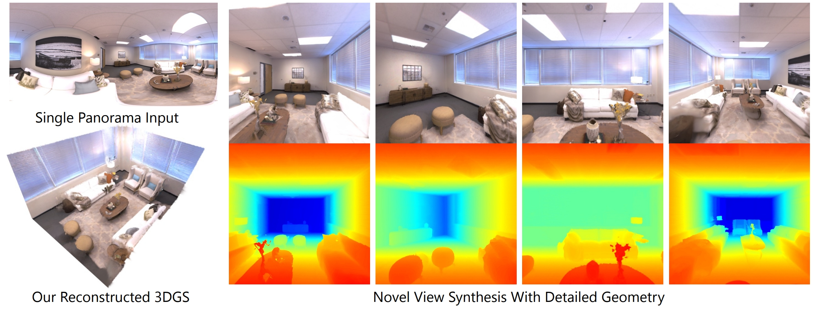
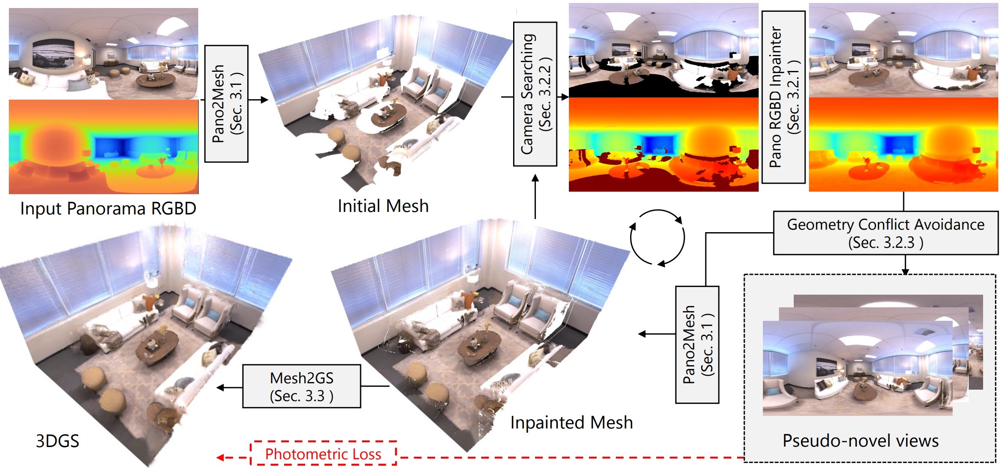
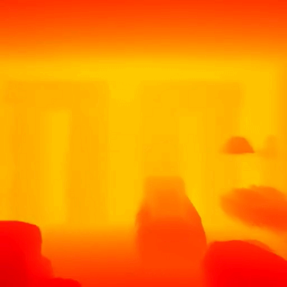

## Welcome to Pano2Room!

[Pano2Room: Novel View Synthesis from a Single Indoor Panorama (SIGGRAPH Asia 2024)](https://arxiv.org/abs/2408.11413).

## Overview
#### In short, Pano2Room converts an input panorama into 3DGS. 




## Demo
In this demo, specify input panorama as:


Then, Pano2Room generates the corresponding 3DGS and renders novel views:


And the corresponding rendered depth:



## Quick Run
### 0. Setup the environment
(1) Create a new conda environment and install [Pytorch3D](https://github.com/facebookresearch/pytorch3d) (for mesh rendering) and [diff-gaussian-rasterization-w-depth](https://github.com/JonathonLuiten/diff-gaussian-rasterization-w-depth) (for 3DGS rendering with depth) accordingly. Other requirements are specified in \<requirements.txt\>. 

(2) Download pretrained weights in \<checkpoints\> (for image inpainting and depth estimation). See \<checkpoints/README.md\> for instructions.

### 1. Run Demo
```
sh scripts/run_Pano2Room.sh
```
This demo converts \<input/input_panorama.png\> to 3DGS and renders novel views as in \<output/Pano2Room-results\>.

### (Optional) 0.5. Fine-tune Inpainter (SDFT)

Before running step 1., you can also fine-tune SD Inpainter model for better inpainting performance for a specific panorama. To do this:

(1) Create self-supervised training pairs:
```
sh scripts/create_SDFT_pairs.sh
```
The pairs are then stored at \<output/SDFT_pseudo_pairs\>.

(2) Training:
```
sh scripts/train_SDFT.sh
```
The SDFT weights are then stored at \<output/SDFT_weights\>.

Then by running step 1., the SDFT weights will be automatically loaded.

Notice this step needs to be performed for each new panorama. If you don't want to train SDFT for a new panorama, delete previous \<output/SDFT_weights\> if exists.

## Try on your own panorama

Simply replace \<input/input_panorama.png\> with your own panorama and run the previous steps!

#### Camera Trajectory
We provide a camera trajectory at \<input/Camera_Trajectory\> as in the above demo. Each file consists of [R|T] 4*4 matrix of a frame. Feel free to use more camera trajectories.


## Cite our paper

If you find our work helpful, please cite our paper. Thank you!

ACM Reference Format:
```
Guo Pu, Yiming Zhao, and Zhouhui Lian. 2024. Pano2Room: Novel View Synthesis from a Single Indoor Panorama. In SIGGRAPH Asia 2024 Conference Papers (SA Conference Papers '24), December 3--6, 2024, Tokyo, Japan. ACM, New York, NY, USA, 10 pages.
https://doi.org/10.1145/3680528.3687616
```
